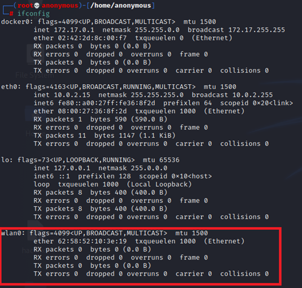

# TUTORIAL

## HACKEANDO REDES WI-FI WPA2

**OBS**:Para este tutorial estarei usando uma distribuição do Kali Linux. Esta distro já contém todos os softwares necessários que serão utilizados nesse passo-a-passo. Você pode utilizar qualquer outra distribuição Linux, porém precisará instalar cada ferramenta separadamente. TODOS OS COMANDOS DEVEM SER EXECUTADOS COMO ADMINISTRADOR. SE NÃO TIVER CERTEZA SE TEM OS PRIVILÉGIOS ADICIONE:

        sudo

NO INICIO DE CADA COMANDO.

**********************************

Vamos lá...

1. Você irá precisar um adaptador Wi-fi. Os notebooks já possuem conexão Wireless integrada, se você tiver um desktop precisará de um adaptador USB ou PCI.  

2. Abra um terminal, então digite:

        ifconfig
    serão listados todos os seus adaptadores de rede:  

    